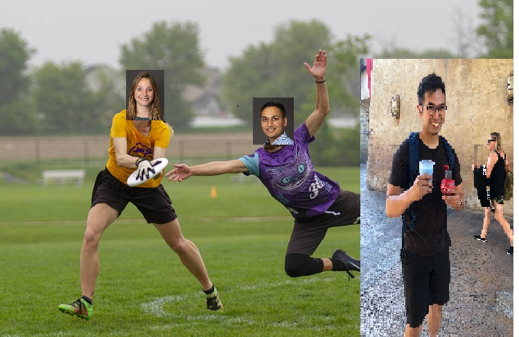

```{r setup, include=FALSE}
knitr::opts_chunk$set(echo = FALSE)
```

```{r}
library(leaflet)

# icon <- makeIcon(
   # iconUrl = "https://usaultimate.org/wp-content/uploads/2019/11/usau-ultimate-logo.svg",
   # iconWidth = 30*400, iconHeight = 30,
   # iconAnchorX = 30*400, iconAnchorY = 30
# )

popup <- c("<a href= 'https://usaultimate.org/rules/' >Rules<br></a>")

map <- leaflet() %>% addTiles()
map %>%
   addTiles() %>%
   addMarkers(lat=34.2142480, lng=-119.0273520, popup = popup)
```


## Wednesday, January 6, 2021 at 1800

